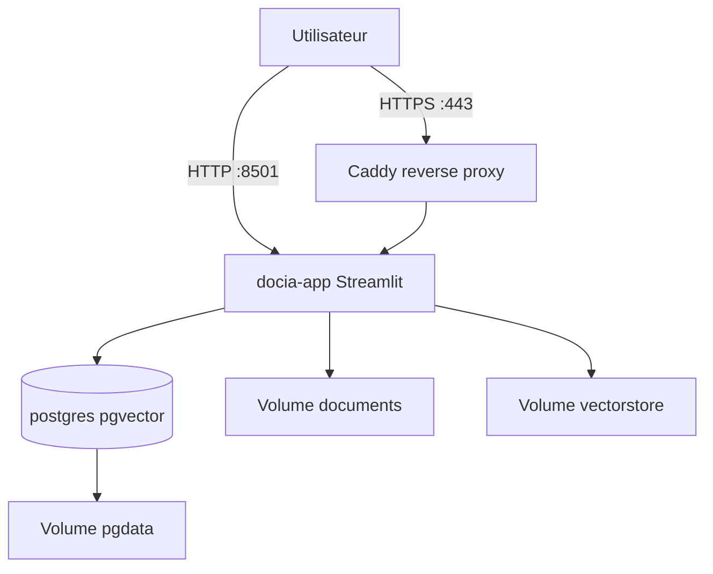

# Déploiement production — France Civique IA (DocIA)

Guide pour déployer l'application sur un **VPS Linux** avec Docker Compose (Streamlit + PostgreSQL pgvector + HTTPS optionnel).

---

## 1. Prérequis

| Élément | Minimum recommandé |
|---------|-------------------|
| VPS | 2 vCPU, 4 Go RAM, 40 Go SSD |
| OS | Ubuntu 22.04+ / Debian 12+ |
| Logiciels | Docker 24+, Docker Compose v2 |
| Réseau | Ports 80, 443 (HTTPS) ou 8501 (HTTP direct) |
| Clé OpenAI | Obligatoire (`OPENAI_API_KEY`) |

---

## 2. Architecture déployée



| Service | Rôle | Réseau |
|---------|------|--------|
| `postgres` | Base vectorielle + cache | Interne uniquement |
| `app` | Interface Streamlit + multi-agent | Public + interne |
| `caddy` | HTTPS Let's Encrypt (optionnel) | Public |

Fichiers ajoutés pour le déploiement :

```
├── Dockerfile
├── docker-compose.prod.yml
├── .env.production.example
├── .streamlit/config.toml
├── docker/entrypoint.sh
└── deploy/
    ├── Caddyfile
    └── deploy.sh
```

---

## 3. Déploiement rapide (VPS)

### 3.1 Transférer le projet

```bash
# Sur le VPS
git clone <votre-repo> docia
cd docia
```

Ou copiez le dossier via `scp` / SFTP.

### 3.2 Configurer les secrets

```bash
cp .env.production.example .env
nano .env
```

**Obligatoire :**

```env
OPENAI_API_KEY=sk-...
POSTGRES_PASSWORD=mot-de-passe-fort-unique
```

**Pour HTTPS (profil Caddy) :**

```env
DOMAIN=france-civique.example.fr
ACME_EMAIL=admin@example.fr
```

### 3.3 Lancer

**Option A — script automatique**

```bash
chmod +x deploy/deploy.sh
./deploy/deploy.sh          # HTTP sur port 8501
./deploy/deploy.sh https    # HTTPS avec Caddy
```

**Option B — commandes manuelles**

```bash
# HTTP seul (port 8501)
docker compose -f docker-compose.prod.yml up -d --build

# Avec HTTPS
docker compose -f docker-compose.prod.yml --profile https up -d --build
```

### 3.4 Ingérer le corpus (première fois)

L'ingestion n'est **pas** lancée automatiquement (trop longue au démarrage).

```bash
# PostgreSQL (stack principal)
docker compose -f docker-compose.prod.yml exec app python main.py pg-ingest

# ChromaDB (secours — recommandé)
docker compose -f docker-compose.prod.yml exec app python main.py index

# Optionnel : rafraîchir les sources officielles
docker compose -f docker-compose.prod.yml exec app python main.py scrape --ingest
```

### 3.5 Vérifier

```bash
docker compose -f docker-compose.prod.yml ps
docker compose -f docker-compose.prod.yml logs -f app
curl -s http://localhost:8501/_stcore/health
```

Accès : `http://IP_DU_VPS:8501` ou `https://votre-domaine.fr`

---

## 4. Variables d'environnement production

| Variable | Défaut | Description |
|----------|--------|-------------|
| `OPENAI_API_KEY` | — | **Obligatoire** |
| `POSTGRES_PASSWORD` | — | **Obligatoire** (mot de passe DB) |
| `POSTGRES_USER` | `docia` | Utilisateur PostgreSQL |
| `POSTGRES_DB` | `docia_fr` | Nom de la base |
| `APP_PORT` | `8501` | Port exposé (sans Caddy) |
| `DOMAIN` | — | Domaine pour Caddy (profil https) |
| `ACME_EMAIL` | — | Email Let's Encrypt |
| `RUN_PG_INIT` | `true` | Créer tables au démarrage |
| `AUTO_PG_INGEST` | `false` | Ingérer au démarrage (long) |
| `AUTO_CHROMA_INDEX` | `false` | Indexer Chroma au démarrage |
| `FAST_MODE` | `true` | Réponses plus rapides |
| `LLM_PROVIDER` | `openai` | `openai` ou `ollama` |

`DATABASE_URL` est **injectée automatiquement** par Compose (`postgres:5432` en réseau interne).

---

## 5. Volumes persistants

| Volume | Contenu |
|--------|---------|
| `pgdata` | Base PostgreSQL |
| `docia_documents` | Fichiers sources |
| `docia_vectorstore` | Index ChromaDB |
| `caddy_data` | Certificats TLS |

Au **premier démarrage**, les documents embarqués dans l'image sont copiés dans `docia_documents`.

---

## 6. Commandes d'administration

```bash
# Logs
docker compose -f docker-compose.prod.yml logs -f app

# Shell dans le conteneur
docker compose -f docker-compose.prod.yml exec app sh

# Stats corpus
docker compose -f docker-compose.prod.yml exec app python main.py pg-stats

# Vider le cache réponses
docker compose -f docker-compose.prod.yml exec app python main.py pg-cache-clear

# Redémarrer
docker compose -f docker-compose.prod.yml restart app

# Mise à jour (après git pull)
docker compose -f docker-compose.prod.yml up -d --build

# Arrêt
docker compose -f docker-compose.prod.yml down

# Arrêt + suppression volumes (⚠️ perte de données)
docker compose -f docker-compose.prod.yml down -v
```

---

## 7. HTTPS avec Caddy

1. Pointez le DNS `A` de votre domaine vers l'IP du VPS.
2. Ouvrez les ports **80** et **443** (pare-feu).
3. Configurez `DOMAIN` et `ACME_EMAIL` dans `.env`.
4. Lancez avec le profil `https` :

```bash
docker compose -f docker-compose.prod.yml --profile https up -d --build
```

Caddy obtient automatiquement un certificat Let's Encrypt.

---

## 8. Sécurité

- **Ne jamais** committer `.env` (clé OpenAI, mot de passe Postgres).
- PostgreSQL **n'est pas exposé** sur Internet (réseau interne Docker).
- Changez `POSTGRES_PASSWORD` avant la première mise en production.
- Régénérez la clé OpenAI si elle a été exposée.
- Pour un site public : ajoutez une authentification (Caddy basic auth, VPN, ou OAuth Streamlit).
- Limitez le pare-feu : n'ouvrez que 80/443 (ou 8501 en dev).

### Authentification basique Caddy (optionnel)

Ajoutez dans `deploy/Caddyfile` avant `reverse_proxy` :

```
basicauth {
    admin $2a$14$...hash_bcrypt...
}
```

Générer le hash : `caddy hash-password`

---

## 9. Test local du build production (Windows)

```powershell
copy .env.production.example .env
# Éditez OPENAI_API_KEY et POSTGRES_PASSWORD

docker compose -f docker-compose.prod.yml up -d --build
docker compose -f docker-compose.prod.yml exec app python main.py pg-ingest
```

→ http://localhost:8501

> Le `docker-compose.yml` de développement (Postgres seul sur port 5433) reste inchangé.

---

## 10. Dépannage

| Problème | Solution |
|----------|----------|
| `app` redémarre en boucle | `docker compose -f docker-compose.prod.yml logs app` — vérifier `OPENAI_API_KEY` |
| PostgreSQL inaccessible | Attendre le healthcheck ; vérifier `POSTGRES_PASSWORD` |
| Corpus vide | Lancer `pg-ingest` manuellement |
| HTTPS échoue | DNS propagé ? Ports 80/443 ouverts ? |
| Build lent / OOM | VPS 4 Go minimum ; `FAST_MODE=true` |
| Certificat Let's Encrypt | Vérifier `DOMAIN` pointe vers le VPS |

---

## 11. Développement vs production

| | Développement | Production |
|--|---------------|------------|
| Fichier Compose | `docker-compose.yml` | `docker-compose.prod.yml` |
| Postgres port | `5433` (hôte) | Interne seulement |
| App | `python run_app.py` (hôte) | Conteneur `docia-app` |
| DATABASE_URL | `localhost:5433` | `postgres:5432` |

---

Voir aussi : [PROJET_COMPLET.md](PROJET_COMPLET.md) · [CONFIGURATION.md](CONFIGURATION.md) · [DEPANNAGE.md](DEPANNAGE.md)
